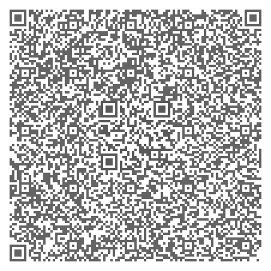
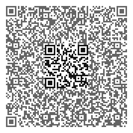

# Crypto Puzzles

Crypto Puzzles is a tool and library to provide a bunch of functions for encryption and stegonagraphy as puzzles or brain teasers. 

Most easy ciphers require zero knowledge about the algorithm used. These puzzles can be "cracked" without any boring explanation, tables or tools. It should be sufficient to know that the the first words are always the same, e.g. "Top secret" to find the pattern and figure out how the secret code works. This makes it possible to decrypt the rest of the message. (Cryptographers would call it a known plaintext attack.) 

Here's a running instanceof the [web interface](<http://rupp.de/crypto_puzzles/crypto_puzzles_web.py>) which supports most of the functions.

Example sentence:

  ```opT ecret!s heT ookiesc rea iddenh ni het edr owl!b```

By searching for "Top secret" in the first two words, you can recognize, that the first letter was moved to the last position (making it a basic transposition cipher). Using that knowledge, the rest of the sentence can be decrypted.

 ```Top secret! The cookies are hidden in the red bowl!```
 
Most functions have varying difficulty measured in school grades. For example this QR code looks quite normal on the first sight but contains a second QR code in the middle (simple example of an steganographic image):



Scanning the outer QR code gives a hint on how to scan the inner one. The following QR code is much easier to tackle because there is contrast between the two QR codes and the hint is much more explicit:



For the experimental feature to nest three QR codes inside each other, see [Matryoshka QR codes](matryoshka_qr.md)

## Difficulty

The school grades are just a rough estimate which kids should be able to tackle which level. Of course this also depends on your national school system and puzzling experience of the kids. In doubt start low to keep it fun and avoid frustration. There isn't a minimum age or grade but kids should be able to read fluently to enjoy the puzzles.

### Other examples
([complete list](<https://htmlpreview.github.io/?https://github.com/2d4d/crypto_puzzles/blob/master/examples/Examples.html>))

#### a) Transposition ciphers

* Moved whitespace: ```To pSecr et!T heCookie sA reHidd enI nTh eRe dB owl!```
* Randomize middle of words: ```Top setrce! The coekios are hieddn in the red bolw!```

#### b) Substitution ciphers

* Emoji Alphabet: 🔝     ⑀ ℰ ©️ ᚱ € 𝔱 ❗️     ᵺ 📧     ㏇ 🆗 ℹ️ € ⚡     ꬃ Ȑ モ     ℏ 🆔 🌛 € ♑     ï ℕ     ᵺ ℰ     Ɽ € 🌛     ط 𝔬 ₩ £ ❗️  
* Upside down every 2nd word: ```Top ¡ʇǝɹɔǝs The sǝᴉʞooɔ are uǝppᴉɥ in ǝɥʇ red ¡ꞁʍoq```
* Leet speak: ```T0p $3cr3t! Th3 c00k13$ @r3 h1dd3n 1n th3 r3d b0wl!```
* Camelcase: ```tOp sEcReT! tHe cOoKiEs aRe hIdDeN In tHe rEd bOwL!```
* Characters to numbers: ```20,15,16, 19,5,3,18,5,20,!, 20,8,5, 3,15,15,11,9,5,19, 1,18,5, 8,9,4,4,5,14, 9,14, 20,8,5, 18,5,4, 2,15,23,12```
* Characters to roman numbers: ```XX,XV,XVI, XIX,V,III,XVIII,V,XX,!, XX,VIII,V, III,XV,XV,XI,IX,V,XIX, I,XVIII,V, VIII,IX,IV,IV,V,XIV, IX,XIV, XX,VIII,V, XVIII,V,IV, II,XV,XXIII,XII!```
* 2000 year old URL: ```https://CXCII.CLXVIII.I.CXXIII/puzzle.py (https://192.168.1.123/puzzle.py)```
* rot13: ```Gbc frperg! Gur pbbxvrf ner uvqqra va gur erq objy!```

#### c) Steganography (hiding information in other information)

* First letter of words contain the message (Like an Acrostic): ```tunnel orange perfect sabre empire computer ring empire tunnel ! tunnel hobbit empire computer orange orange kangaroo internet empire sabre antelop ring empire hobbit internet dolphin dolphin empire nose internet nose tunnel hobbit empire ring empire dolphin bug orange wardrobe lumber !```
* Numbers inserted: ```T61o61p5s87e14c55r48e37t0!4T0h66e28c64o66o29k87i64e89s18a11r10e73h23i62d37d87e14n58i85n63t50h54e96r74e53d18b92o10w7l10!18```
* This stegosaurus (original by R.Millward) contains the numbers 603:
```
                         .       .
                        / `.   .' \
                .---.  <    > <    >  .---.
                |    \  \ - ~ ~ - /  /    |
                 ~-..-~             ~-..-~
             \~~~\.'                    `./~~~/
              \__/                        \__/
               /                  .-    .  \
        _._ _.-    .-~ ~-.       /       }   \/~~~/
    _.-'6  }~     /       }     {        ;    \__/
   {'__,  /      (       /      {       /      `. ,~~|   .     .
    `''''='~~-.__(      /_      |      /- _      `..-'   \\   //
                / \   =/  ~~--~~{    ./|    ~-.     `-..__\\_//_.-'
               {   \  +\         \  =\ (        ~ - . _ _ _..---~
               |  | {   }         \   \_\
              '---.0___,'       .3___,'       
```


#### d) Crackme programs
 
A crackme is a small Python program that contains a secret message, but won't show it until the player has understood the code, found the obstacle and removed it. 

The following example simply waits gazillions years before decoding and printing it's secret message. It can be easily solved by either removing all the sleep statements, moving the print above them or decoding the base64-string with another tool.

```python
#!/usr/bin/env python3

# This little script knows the secret you are looking for,
# but will only tell it in 890601 billion years, harhar :)
# If you don't have this much time, find a quicker way ...

# Python3!

import base64
import time

time.sleep(1)
ʇxǝʇ = 'The secret ... '
print(ʇxǝʇ, end='', flush=True)

time.sleep(2)
print(' is really very secret ... ', end='', flush=True)

time.sleep(4)
print(' so I wil tell it to you in 890601 billion years!', end='', flush=True)

time.sleep(988989789)
print ('Thanks for waiting, here is your secret: ' + base64.b64decode('VG9wIHNlY3JldCEgVGhlIGNvb2tpZXMgYXJlIGhpZGRlbiBpbiB0aGUgcmVkIGJvd2wh').decode('utf8'))
```
 
So far the crackmes are only in python, as this is the most popular programming language among kids at the moment. But they can be written in any programming language (Scratch or even Scratch Jr. would be interessing)

Of course lots of antique and classical kids ciphers are still missing. Contributions are always welcome! If you want to contribute another crypto function, the easiest way is to copy an existing similar one and change it.

Use an editor/IDE with full utf8 support because of all the funny characters in the code.

Functions which are language dependent are supported in English and German so far.

## Purpose

The simplest use of Crypto Puzzles: Hide some sweets as a treasure and encrypt the location with Crypto Puzzles, print it out and give it to your kids. To make it more interesting, you could also hide that printout and create another puzzle which points to it. Hide this note again and use an ultraviolet marker to draw a trail of arrows through your whole house which point to it. Give your kids some ultraviolet lamps and enjoy the show. If you want to automate all of this, use Euli Treasure Hunt (<https://github.com/2d4d/euli_treasure_hunt>), which was the initial reason to write Crypto Puzzles)

## Other uses of Crypto Puzzles:
* Create puzzles for treasure hunts, mystery geocaches, escape rooms at home or junior capture the flag hacking competitions.
* It's especially useful for groups with different age or skill sets. Very often treasure hunts end up in the way, that the oldest kids solve all the puzzles and the youngest don't even understand, what's going on. With Crypto Puzzles it's easy to create individual puzzles with specific difficulty for each player.
* Mystery geocaches can be created with multiple levels of difficulty at the same time for the players to choose from.

# Usage
```
usage: crypto_puzzles.py [-h] --technique TECHNIQUE [--noise_type NOISE_TYPE]
                         [--noise_chars NOISE_CHARS]
                         [--upside_down_rate UPSIDE_DOWN_RATE] [--grade GRADE]
                         [--language LANGUAGE] [--crackme_num CRACKME_NUM]
                         [--num_parts NUM_PARTS] [--seed SEED]
                         [--show_function_name] [--ƃnqǝp]
                         [--outer_text OUTER_TEXT] [--filename FILENAME]
                         plaintext

positional arguments:
  plaintext             Plain text to be "encrypted"

optional arguments:
  -h, --help            show this help message and exit
  --technique TECHNIQUE, -T TECHNIQUE
                        Techniques used to "encrypt". Such argument is a
                        string composed by any combination of
                        NUMLlWmSC13AncjqQRuf characters where each letter
                        stands for a different technique (details on github).
  --noise_type NOISE_TYPE
                        Type of noise. Can be numbers,numberwords, animals
  --noise_chars NOISE_CHARS
                        Character(s) for noise
  --upside_down_rate UPSIDE_DOWN_RATE
                        Turn every nth word
  --grade GRADE, -g GRADE
                        Adjust difficulty by school grade aka years of school
                        experience.
  --language LANGUAGE   Language for hints
  --crackme_num CRACKME_NUM
                        Number of crackme
  --num_parts NUM_PARTS
                        Number of parts for join_puzzle
  --seed SEED           Random seed (only set to static number to always get
                        the same randomness for debugging!)
  --show_function_name  Shows the python function name below the encrypted
                        text (for internal use)
  --ƃnqǝp, -p           Debug
  --outer_text OUTER_TEXT
                        Outer text for QR inside QR
  --filename FILENAME, -f FILENAME
                        Output filename for e.g. QR codes
```

Techniques can be combined, for example this command shifts the letters in the words (S), turns them upside down (U) and puts the result into a QR code inside another QR code (Q):
```
crypto_puzzles.py -T SUQ "Top secret! The cookies are hidden in the red bowl!"
```
The order of the techniques is relevant, not all of them work together and it gets incomprehensible quickly if you use too many.

More usage examples can be found in the last column of the [example list](<https://htmlpreview.github.io/?https://github.com/2d4d/crypto_puzzles/blob/master/examples/Examples.html>).

