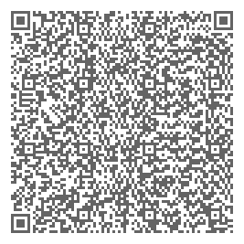

## Matryoshka QR codes

QR codes can be nested into 3 layers, like Russian Matryoshka dolls:

1. Create a unicode QR code (The following is not an image but text, mark some lines to see the difference):
```
▗▄▄▄░▖░▄░▗▄▄▄
▐▗▄▐░█▖▐▄▐▗▄▐
▐▐█▐▐▘▛▌▐▐▐█▐
▐▄▄▟▗▐▐▜▗▐▄▄▟
▗▖░▄▖░▜▄▞░▗▖░
░▀▛▄▝▞▚▀▙▚▛▀▄
░▜▖▄▄▟▄▝▗▚▌▌▞
▐▜▀▗▞░▘▙▛▗▌▗▄
▐▗▞▗▞▄▗▟▐█▄█▟
▗▄▄▄▐▙▙▞▐▗▐▀▜
▐▗▄▐▝▖▀▄█▄▟▙▐
▐▐█▐░▞▘▀▀▛▖▚▗
▐▄▄▟▐▜▄░▐▞▛▌▐
(Looks bad in the font used in github because there is too much distance between the lines, but this doesn't matter because there's another plan ...)
```
Created using: 
```
   ./crypto_puzzles.py -T R "Thecookiesarehiddenintheredbowl!"
```

2. Because it's text, it can be put into another QR, this time a PNG image:



If you scan this QR code with your smartphone, you see QR code #1 from above. This can be scanned directly off the screen using another device. (A combination which works is scanning first using Lightninh QR for android and then scanning with the iOS default QR reader by varying the distance between both phones.)

Created using: 
```
./crypto_puzzles.py -T Rq "Thecookiesarehiddenintheredbowl!"
```

3. The QR code 2 can be put graphically into the middle of a third QR code:


All 3 steps are done using this command:
```
./crypto_puzzles.py -T RQ --grade 2 "Thecookiesarehiddenintheredbowl!"
```
